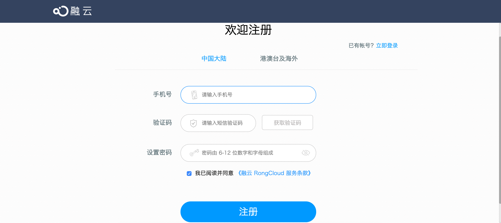
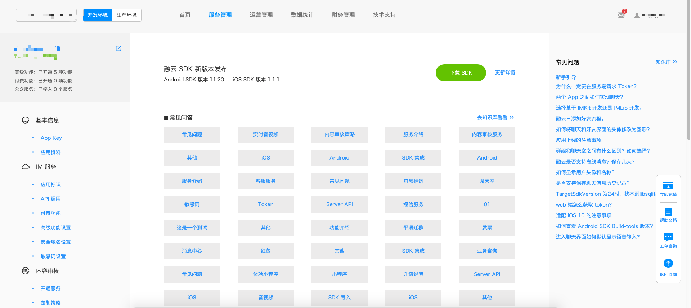
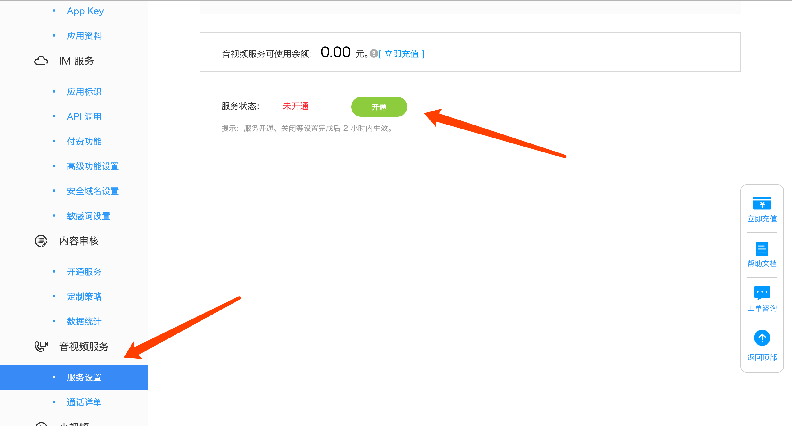

## 前期准备

SealRTC Web 是基于 [RongCloud Web CallLib](https://www.rongcloud.cn/docs/web_calllib.html) 的音视频示例，通过此示例，可更好的帮助您集成、使用 Web CallLib SDK

#### 创建应用

1、移步融云开发者后台: [https://developer.rongcloud.cn](https://developer.rongcloud.cn)

2、输入必要信息注册用户

3、首次登录融云开发者后台

4、创建应用

#### 开通服务

