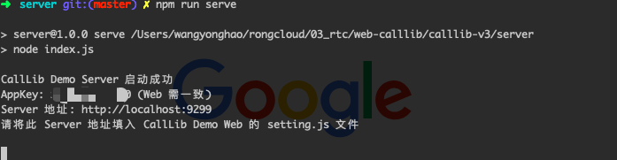

## CallLib Demo Server

**Demo Server 作用**

1、为 CallLib Web Demo 提供获取 token 的接口

2、自动创建群组, 提供进行群组音视频的能力

<b>注</b>: 运行 Web Demo 时, 必须运行 Demo Server, 并且 appKey 配置必须一致

**下载并安装 Node.js**

Node.js 最低版本为 [10+](http://nodejs.cn/download/)，如果机器已安装 Node ，可使用 [NVM](https://github.com/creationix/nvm) 切换版本

**快速启动**

1、下载 Demo Server 源码

[https://github.com/rongcloud/websdk-demo/tree/master/calllib-v3/server](https://github.com/rongcloud/websdk-demo/tree/master/calllib-v3/server)

2、进入 server 根目录执行

```bash
npm install
```

3、修改配置文件 `setting.js`

```js
module.exports = {
  appkey: 'appkey', // 融云应用 AppKey，可在融云开发者后台获取
  secret: 'secret', // 融云应用 Secret，可在融云开发者后台获取
  port: '9929' // 启动服务端口号, 默认 9929, 按需修改
};
```

4、启动服务

```
npm run serve
```

启动成功后, 控制台输出如下:



<b>注</b>: 此 Server 仅供测试, 生产环境 App Server 需部署 https 协议
