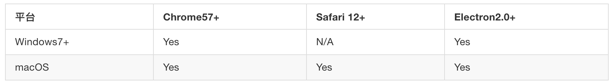
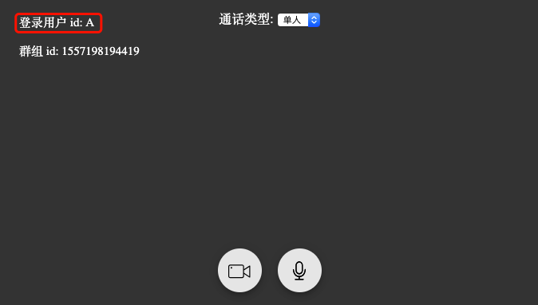
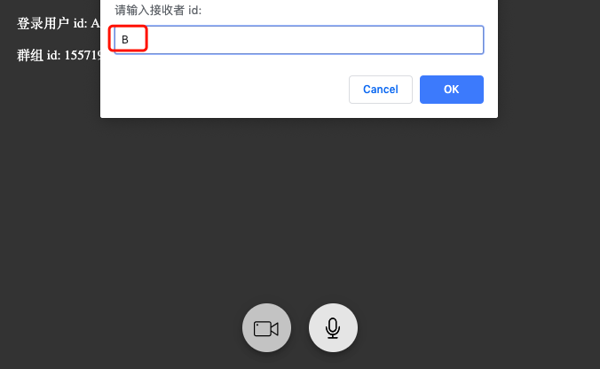
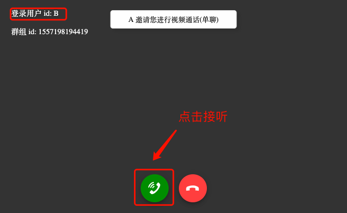
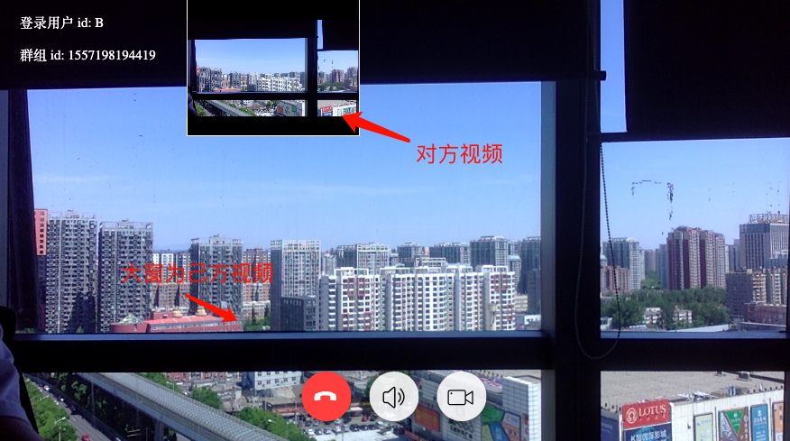

## 演示示例

#### CallLib Demo Web 浏览器兼容性说明

1、在谷歌浏览器使用两个 Tab 页面分别打开 Web Demo: [http://localhost:3582/src/index.html](http://localhost:3582/src/index.html)

2、两个页面分别输入不同的用户 id(例如用户为 A、B), 点击登录, 进入通话界面

3、用户 A 点击视频或音频按钮, 输入用户 B 的 id

4、用户 B 接收到 A 发送的音视频请求, 点击接听按钮

5、开始音视频通话

