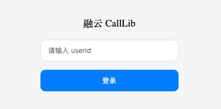
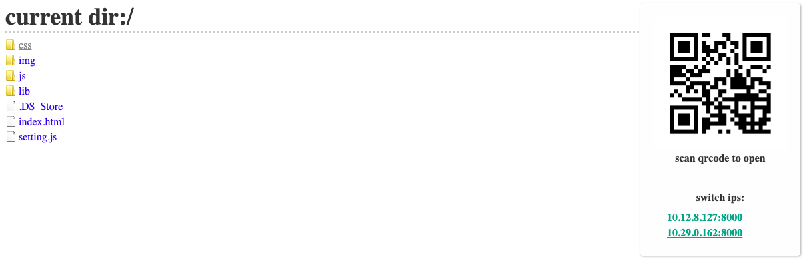

## CallLib Demo Web

1、下载 Demo Web 源码

[https://github.com/rongcloud/websdk-demo/tree/master/calllib-v3/web](https://github.com/rongcloud/websdk-demo/tree/master/calllib-v3/web)

2、修改配置文件 `setting.js`

```js
{
  appkey: 'appkey', // 融云应用 AppKey，可在融云开发者后台获取
  server: 'http://localhost:9929' // Demo Server 地址
}
```

3、启动 `index.html` 开始体验

<b>注</b>: 浏览器限制协议必须是 `HTTPS` 或 `http://localhost:port` 才可使用摄像头、麦克风

所以需准备本地服务，若无本地服务，推荐: [Nginx](http://nginx.org/en/download.html) 或 [Node.js Puer](https://www.npmjs.com/package/puer)

<br><br><br>

使用 Puer 启动服务器示例:

1、全局安装 puer

```bash
npm install puer -g
```

2、打开命令行 `Web Demo` 根目录

```bash
puer --port 3582
```

启动成功后出现如下界面，点击 `index.html` 开始体验


