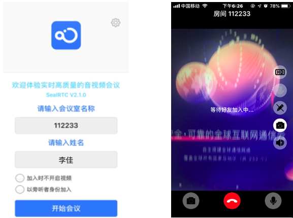

## 远程标注 Demo

### 产品概述

远程标注是基于融云实时音视频能力，结合互动白板，屏幕共享，双流采集，背景降噪，动态标注等技术，满足基于第一视角的远程维修，远程示教等场景下的技术实现方案。开发者可以在此基础上，结合自身的业务需要，快速打造专属的业务产品。
      为专家提供标注系统，在远程现场工作人员提供的第一视角音视频信息基础上，利用双向实时音视频交流，标记，写画，图片展示等能力，指导现场工程师工作的过程。

### 系统支持范围

`Chrome 57+`

### 建立基于Web的远程专家端

1、现场工程师与专家通过公有云建立会场

2、现场工程师通过VR眼镜或手机现场采集，远端专家通过Web远程专家端加入会场

3、专家可以接收现场工程师采集的音视频，并进行实时的双向音视频对话

4、专家通过共享屏幕，可以在现场采集的视频基础上进行，标记（写画），文本输入，显示图片，显示表格

5、专家侧的标注和现场采集的视频，合并后传给现场工程师显示

### Web专家端操作步骤

1、首次使用安装 RongRTC 插件，[点击下载](http://rongcloud-file.ronghub.com/bb94b141e196cca49c.zip?attname=rong-rtc-plugin.zip&e=2147483647&token=livk5rb3__JZjCtEiMxXpQ8QscLxbNLehwhHySnX:wJ_khuHbz3TDso6RL9FMVDQP3QA=):

2、解压 rong-rtc-plugin.zip

3、打开chrome浏览器插件列表，浏览器地址栏输入 chrome://extensions

4、将整个rong-rtc-plugin 文件夹 拖拽至浏览器插件列表中

5、插件安装成功

6、进入演示模式

`浏览器访问`: [https://rongcloud.github.io/websdk-demo/rtc/app](https://rongcloud.github.io/websdk-demo/rtc/app)

7、输入任意房间号，点击加入进行 Demo演示

8、点击分享按钮，进行远程标注

9、点击图片和表格按钮可插入图片和业务表格

### 采集端操作步骤（目前支持手机端采集，支持爱普生 Epson BT350 VR眼镜，但是未来可实现其他型号定制）

1、首先从融云官网 [https://www.rongcloud.cn/downloads/rtc](https://www.rongcloud.cn/downloads/rtc) 下载客户端

2、安装成功后输入和专家端同一房间号进行 Demo演示

