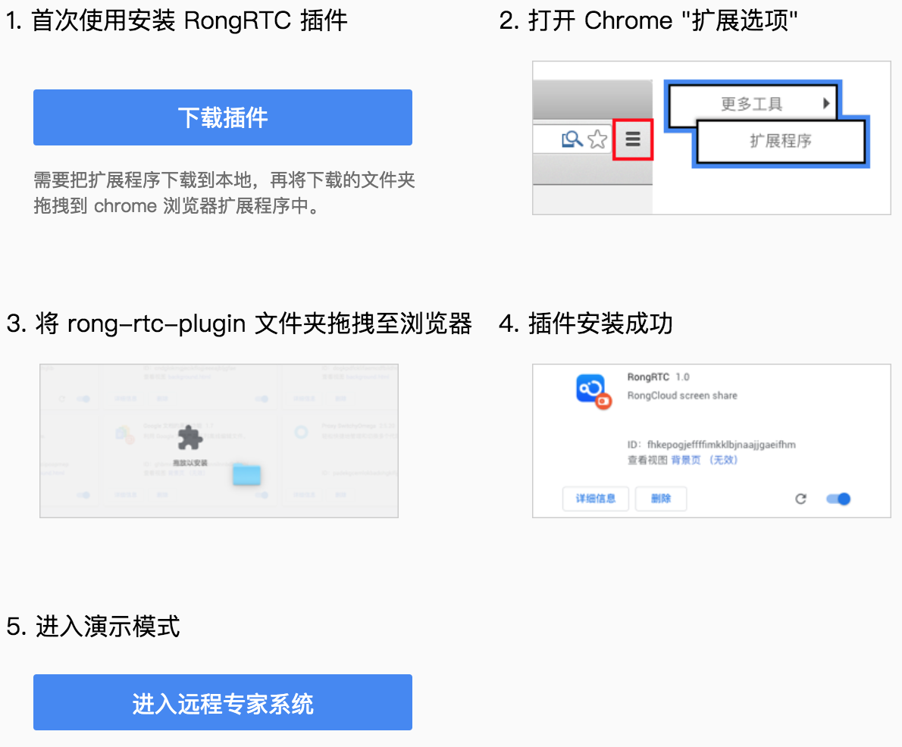
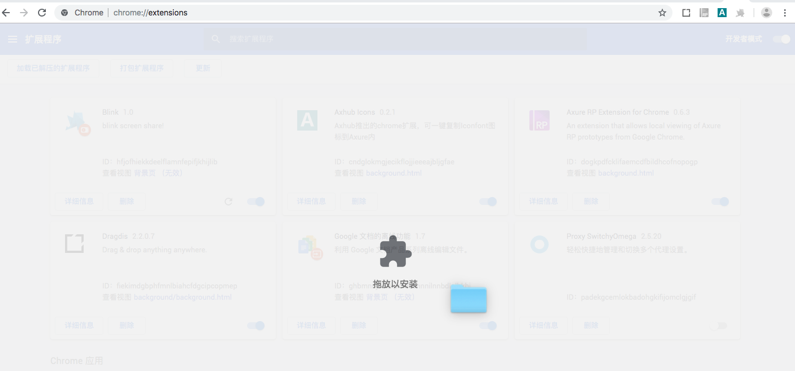
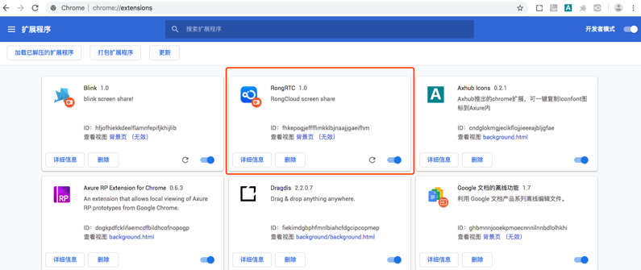
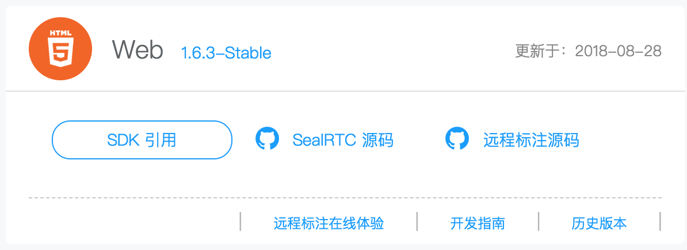
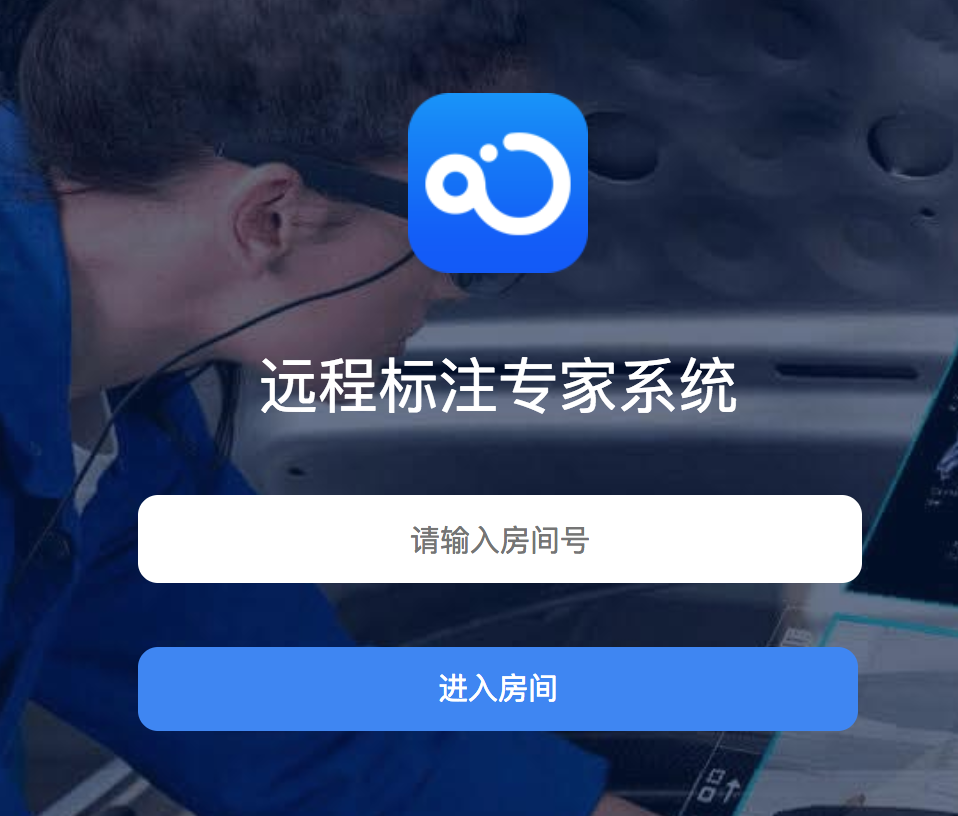
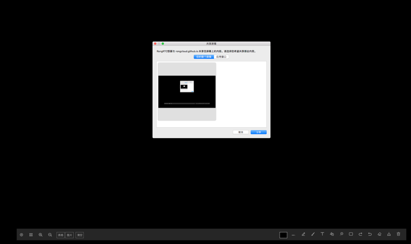
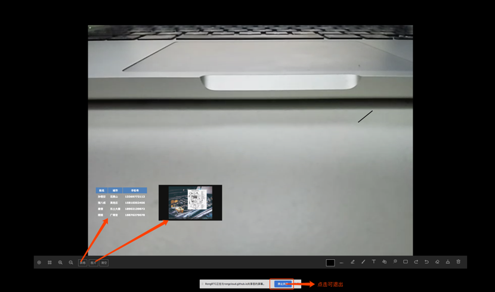
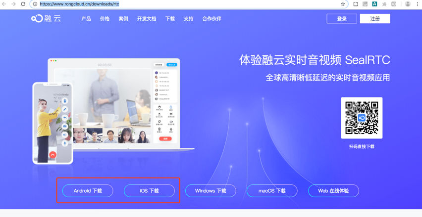
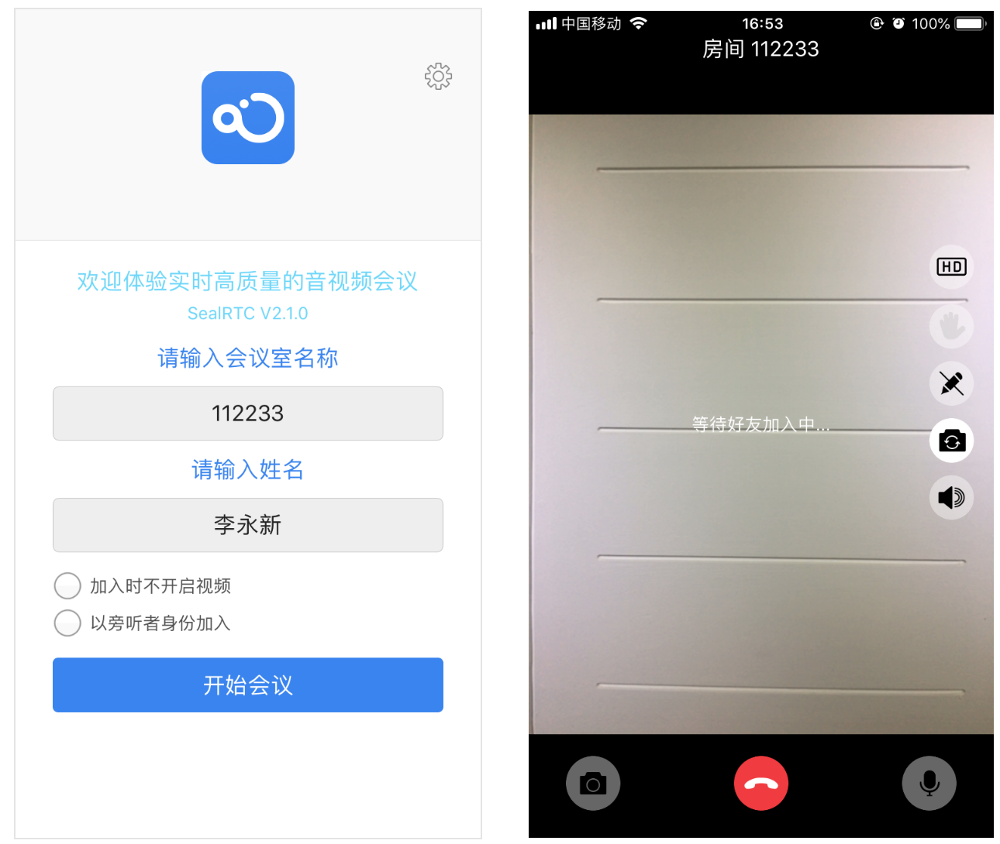

## 远程标注 Demo

### 产品概述

远程标注 Demo 是指利用音视频能力，在远程维护场景下，展示后台专家在前端现场工程师采集的音视频基础上，提供标记，写画，图片展示等能力，指导现场工程师工作的过程。

### 浏览器支持范围

`Chrome 57+`

### 建立基于 Web 的远程专家端

1、现场工程师与专家通过公有云建立会场。

2、现场工程师通过 VR 眼镜或手机现场采集，远端专家通过 Web 远程专家端加入会场。

3、专家可以接收现场工程师采集的音视频，并进行实时的双向音视频对话。

4、专家通过共享屏幕，可以在现场采集的视频基础上进行，标记（写画），文本输入，显示图片，显示表格。

5、专家侧的标注和现场采集的视频，合并后传给现场工程师显示。

### Web 专家端操作步骤

推荐使用 Chrome（谷歌浏览器），首次使用远程标注功能时，页面会引导你安装 RongRTC 插件，根据页面提示操作即可：

1. 下载RongRTC 插件，解压 rong-rtc-plugin.zip.
2.  打开 Chrome 扩展程序列表：在 Chrome 浏览器地址栏中输入“chrome://extensions” 并访问此地址。

3. 将整个 rong-rtc-plugin 文件夹 拖拽至浏览器插件列表中。

4. 插件安装成功

5. 进入演示模式

浏览器访问 [融云官网-下载页-实时音视频-Web 模块](https://www.rongcloud.cn/downloads/rtc)，点击「远程标注在线体验」标签访问远程标注 Demo.

> 素材待更换

> 远程标注源码也可从 [融云官网-下载页-实时音视频-Web 模块](https://www.rongcloud.cn/downloads/rtc) 免费获取。

6. 输入任意房间号，点击进入房间。

   

7. 点击分享屏幕，进行远程标注

8. 点击图片和表格按钮可插入图片和业务表格

### 采集端操作步骤

> 目前支持手机端采集，支持爱普生 Epson BT350 VR 眼镜，未来可实现其他型号定制。

1. 首先从 [融云官网-下载-实时音视频](https://www.rongcloud.cn/downloads/rtc) 页面下载 SealRTC 客户端

2. 安装成功后输入和专家端同一房间号，加入房间后即可和专家进行远程标注互动演示。

